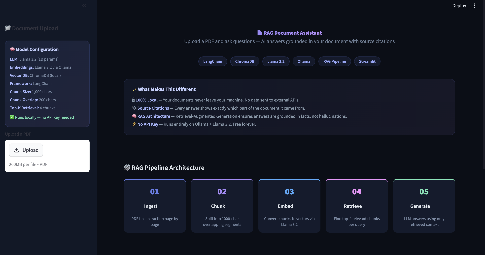
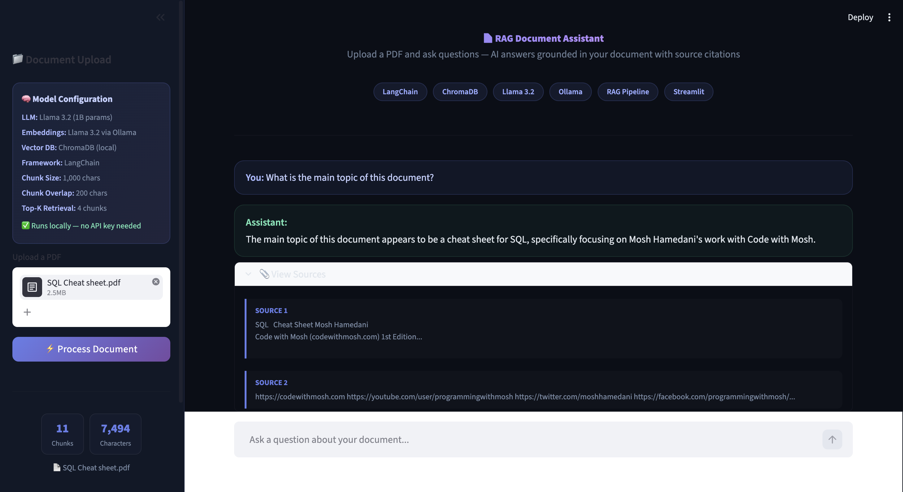

# RAG Document Assistant

I built this because most AI chatbots make things up. They sound confident but they're pulling answers from thin air. I wanted to build something different — an AI assistant that only answers from the document you give it, shows you exactly where the answer came from, and tells you honestly when it doesn't know.

## What It Does

You upload a PDF, and the system breaks it into chunks, converts them into vectors, stores them in a local database, and then when you ask a question, it finds the most relevant sections and generates an answer grounded entirely in your document. Every answer comes with clickable source citations so you can verify it yourself.

The entire system runs locally on your machine. No data leaves your computer. No API keys required.

## Screenshots





## How RAG Works

RAG stands for Retrieval-Augmented Generation. Instead of asking an LLM to answer from its training data (which leads to hallucinations), RAG first retrieves the relevant information from your document and then asks the LLM to generate an answer using only that retrieved context.

Here is the pipeline I built:

1. **Ingest** — PDF text is extracted page by page using PyPDF
2. **Chunk** — Text is split into overlapping 1000-character segments with 200-character overlap to preserve context at boundaries
3. **Embed** — Each chunk is converted to a vector embedding using Llama 3.2 via Ollama
4. **Store** — Vectors are indexed in ChromaDB for fast similarity search
5. **Retrieve** — When you ask a question, the 4 most relevant chunks are found using cosine similarity
6. **Generate** — Llama 3.2 reads the retrieved chunks and generates an answer constrained to that context
7. **Cite** — The system shows which document sections the answer came from

## Why This Architecture

I chose to run everything locally using Ollama instead of cloud APIs for a few reasons. First, document Q&A often involves sensitive content like legal contracts, financial reports, or medical records. Sending that to a third-party API is a non-starter for most companies. Second, running locally eliminates API costs and rate limits entirely. Third, it demonstrates that I can build systems that work without relying on expensive cloud services.

The tradeoff is that a 1B parameter local model is less capable than GPT-4 or Gemini. But for document Q&A where the context is provided, a smaller model performs well because it doesn't need to rely on its own knowledge — it just needs to read and summarize the retrieved text.

## Tech Stack

- **LangChain** — orchestration framework for the RAG pipeline
- **ChromaDB** — local vector database for storing and searching document embeddings
- **Ollama + Llama 3.2** — local LLM for both embeddings and text generation
- **PyPDF** — PDF text extraction
- **Streamlit** — chat interface with dark theme
- **Python** — everything runs on Python

## Project Structure

- **src/document_processor.py** — PDF extraction and text chunking logic
- **src/vector_store.py** — ChromaDB vector store creation and querying
- **src/rag_chain.py** — RAG chain connecting retriever to LLM with custom prompt
- **app.py** — Streamlit chat interface with document upload
- **DECISIONS.md** — technical decisions and reasoning
- **data/chroma_db/** — vector database storage (generated locally, not in repo)

## How to Run

```bash
# Clone the repo
git clone https://github.com/GirirajKudupudi/rag-document-assistant.git
cd rag-document-assistant

# Install Ollama (Mac)
# Download from https://ollama.com

# Pull the model
ollama pull llama3.2:1b

# Install Python dependencies
pip install langchain langchain-core langchain-community langchain-ollama langchain-text-splitters chromadb pypdf streamlit

# Run the app
streamlit run app.py

# Upload any PDF and start asking questions
```

## Key Design Decisions

- **Chunk size of 1000 characters with 200 overlap** — large enough to preserve paragraph-level context but small enough for precise retrieval. The overlap ensures no information is lost at chunk boundaries.
- **Top-4 retrieval** — retrieving 4 chunks balances providing enough context for a good answer while not overwhelming the LLM with irrelevant information.
- **Temperature 0.3** — low temperature keeps answers factual and deterministic. Higher temperatures would introduce more creativity, which is the opposite of what you want in a document Q&A system.
- **Local-first architecture** — no external API dependencies means this system works offline, handles sensitive documents safely, and has zero operational cost.

## What I Would Improve

If this were a production system, I would add evaluation metrics tracking hallucination rate across a test set of questions, support for multiple document formats beyond PDF, conversation memory so the assistant remembers earlier questions in the session, a hybrid search combining keyword matching with vector similarity for better retrieval, and user feedback collection to continuously improve retrieval quality.

## About Me

I'm Giriraj Kudupudi. I have a Master's in Data Analytics and I'm building production-grade AI systems. This RAG assistant is part of my portfolio demonstrating that I can work with LLMs, vector databases, and retrieval systems — the most in-demand AI skills in 2026.

- [GitHub](https://github.com/GirirajKudupudi)
- [LinkedIn](https://linkedin.com/in/giriraj-kudupudi-6469ba192)